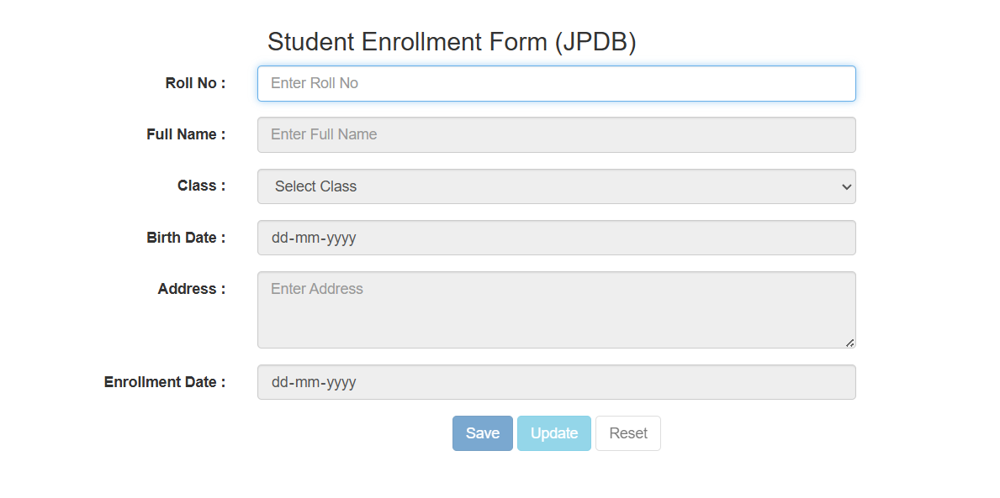
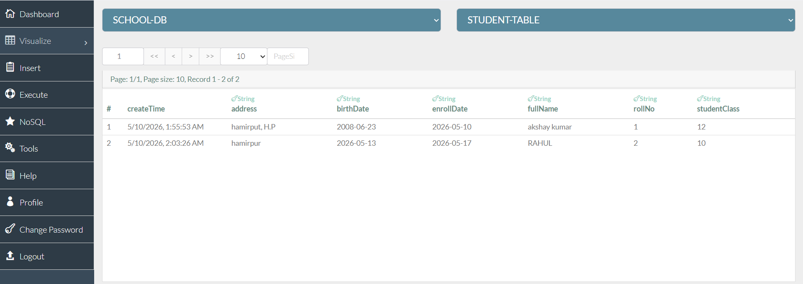

# Student Enrollment Form (JsonPowerDB)

## Title of the Project

Student Enrollment Form

## Description

This project is a lightweight student enrollment form that stores and updates data in JsonPowerDB. It uses Roll No as the primary key and follows a guided workflow: lookup first, then create or update based on the result. The UI is intentionally minimal to keep data entry fast and consistent.

## Benefits of using JsonPowerDB

- JSON-first storage with simple REST APIs and fast key-based lookups.
- Schema-free model that adapts easily as form fields evolve.
- Low setup overhead, ideal for prototypes and micro-projects.
- Good fit for form-centric apps where quick CRUD is the priority.

## Scope of Functionalities

- Create a student record with mandatory field validation.
- Retrieve existing records by Roll No and auto-fill the form.
- Update an existing record while keeping the primary key locked.
- Reset the form to the initial lookup state.

## How It Works

1. Enter Roll No and leave the field to trigger a lookup.
2. If no record exists, the form unlocks and Save is enabled.
3. If a record exists, the form is filled, Roll No is locked, and Update is enabled.
4. Reset clears the form and returns to the lookup state.

## Validation Rules

- Roll No is required.
- Full Name allows alphabets and spaces only.
- Class is selected from a fixed list (10th, 12th, Graduation, Post Graduation).
- Birth Date, Address, and Enrollment Date are required.

## Configuration

Update these values in the script to point to your JsonPowerDB setup:

```text
Database: SCHOOL-DB
Relation: STUDENT-TABLE
Primary Key: Roll No
API Base URL: http://api.login2explore.com:5577
```

## Getting Started

1. Open the project folder and launch index.html in your browser.
2. Enter a Roll No to trigger the lookup.
3. If the record is new, fill the form and click Save.
4. If the record exists, edit fields and click Update.
5. Click Reset to clear the form and return to lookup mode.

## API Examples

PUT (create):

```json
{
  "token": "<YOUR_TOKEN>",
  "dbName": "SCHOOL-DB",
  "cmd": "PUT",
  "rel": "STUDENT-TABLE",
  "jsonStr": {
    "rollNo": "1",
    "fullName": "Akshay Kumar",
    "studentClass": "12th",
    "birthDate": "2005-06-23",
    "address": "Hamirpur, Himachal Pradesh",
    "enrollDate": "2026-05-10"
  }
}
```

GET_BY_KEY (retrieve):

```json
{
  "token": "<YOUR_TOKEN>",
  "dbName": "SCHOOL-DB",
  "cmd": "GET_BY_KEY",
  "rel": "STUDENT-TABLE",
  "jsonStr": {
    "rollNo": "1"
  }
}
```

UPDATE (modify):

```json
{
  "token": "<YOUR_TOKEN>",
  "dbName": "SCHOOL-DB",
  "cmd": "UPDATE",
  "rel": "STUDENT-TABLE",
  "jsonStr": {
    "1": {
      "rollNo": "1",
      "fullName": "Akshay Kumar",
      "studentClass": "12th",
      "birthDate": "2005-06-23",
      "address": "Bilaspur,Himachal Pradesh",
      "enrollDate": "2026-05-10"
    }
  }
}
```

## Screenshots




## Project Status

Active - initial working version with create, retrieve, and update flows.

## Release History

- v1.0.0 - Initial release of the Student Enrollment form with JsonPowerDB integration. (https://github.com/Akshay-GH/MICRO-PROJECT-JSONDB/releases/tag/v1.0.0)

## Sources

- JsonPowerDB documentation
- jQuery documentation
- Bootstrap documentation
